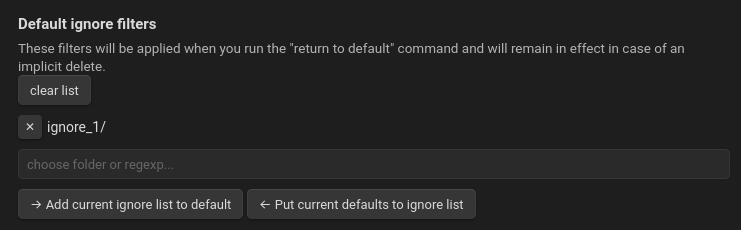
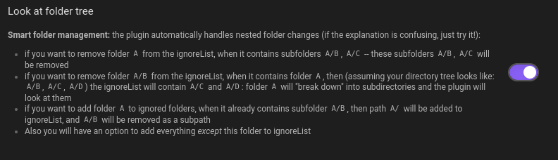
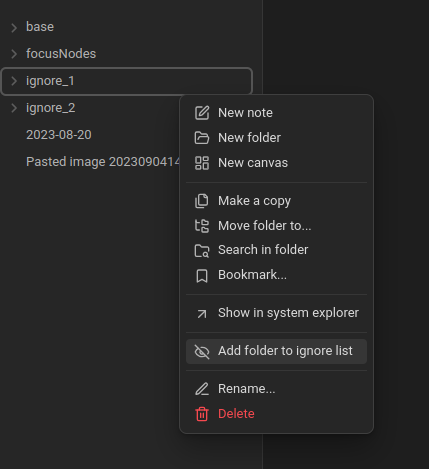
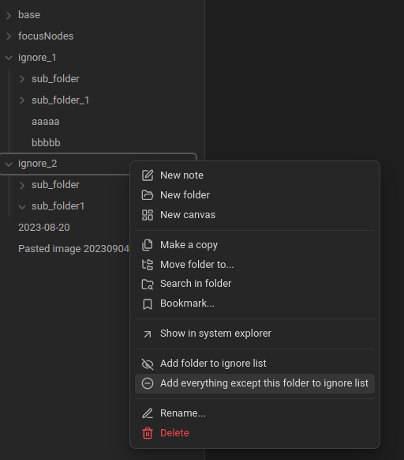
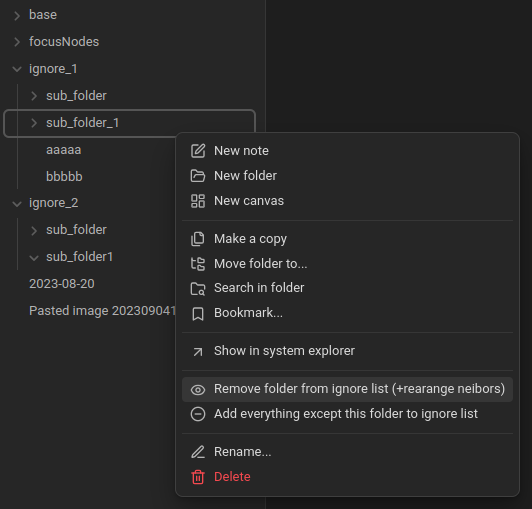

# Ignore Filters Boost
[Obsidian.md plugin](https://obsidian.md/) to speed up working with excluded/included folders! 

👆 No need to go to settings anymore, just click on a folder!

## What does this plugin do?
- 👆 Click on a folder to add it to "excluded files".
- 👆 Click on a folder to remove it from "excluded files".

## Some advanced techniques
- Want to focus on a specific folder? Click "Add everything except this folder"!
- Want to remove a folder from "excluded files", but its parent is still in the list? The plugin will automatically remove the parent and add siblings!
- Want to remove several subfolders from "excluded files"? Just click on their parent!
- Want to return to default? Do it in one command!

## 📖 Manual
*The plugin works with folders, not files.*

Set "default ignore filters" in settings. 

- Use the `Ignore Filters Boost: return ignore filters to default` command to return to these filters.
- The plugin will not remove these folders implicitly: if you try to remove subfolders of a folder from the ignore list, the "default" filters will remain unchanged.

- Clicking `Add current ignore list to default` will add the "excluded files" that are currently in your project to "default ignore filters".
- Clicking `Put current defaults to ignore list` will change "excluded files" to the list you see in these settings (same as the `Ignore Filters Boost: return ignore filters to default` command).

If "Look at folder tree" is off, you'll just add or remove a folder. 

But when "Look at folder tree" is on...

"add everything" and then just "ignore_2/" will remain unignored. `"base/", "focusNodes/", "ignore_1/"` — all these folders will be in "excluded files".

This plugin simplifies making changes in ignore filters. Add commands with lists of ignore filter variants.

...and then you can remove `"ignore_1/sub_folder_1/"` from the ignore list. But if the list has only `"ignore_1/"`, it will be rearranged: the parent folder will be removed and siblings added. So now `ignore_1/sub_folder/` will be in the list :)

---

## 🔮 Future Plans 
Some plans for the project. Feel free to ask for features by creating issues!
- Language translation. I want to add support for different languages.
- Create a "white list" of folders as a counterpart to the black (ignore filters) list.
- Add workspaces. During publishing, I found the [Smart Excluded Files plugin](https://github.com/vlwkaos/obsidian-smart-excluded). It had some similar ideas, so maybe I'll include this functionality here.
